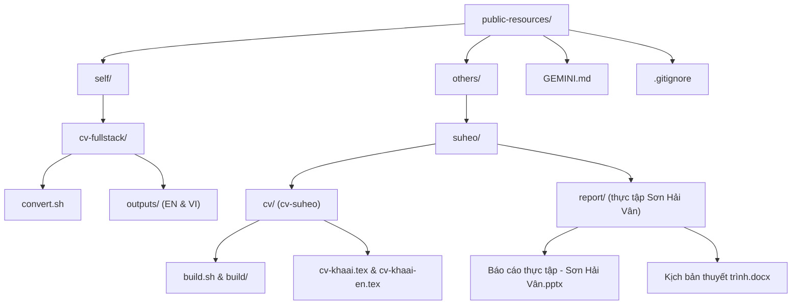

# Kế hoạch tái cấu trúc repository: Phân nhóm `self/` và `others/`

## Tổng quan & Mục tiêu

Tái cấu trúc thư mục của repository `public-resources` để phân định rõ ràng giữa:
* **`self/`**: Chứa toàn bộ tài nguyên, hồ sơ CV cá nhân của chủ sở hữu repo (Trần Văn Còn - `cv-fullstack`).
* **`others/`**: Chứa tài nguyên của những người khác ("mấy người kia"), hiện tại là **Võ Ngọc Khả Ái (Su Hẹo)**.

---

## Yêu cầu người dùng phản hồi (User Review Required)

> [!IMPORTANT]
> **Phương án tổ chức thư mục con bên trong `others/`:**
>
> * **Phương án 1 (Khuyên dùng - Phân cấp theo từng người):**
>   Mỗi người trong `others/` sẽ có một thư mục riêng mang tên/biệt danh của người đó (`others/suheo/`). Mọi tài nguyên của người đó (CV, báo cáo thực tập, slide) được gom chung vào một nơi:
>   ```text
>   others/
>   └── suheo/
>       ├── cv/          (toàn bộ mã nguồn LaTeX, classes, build.sh, file build)
>       └── report/      (báo cáo thực tập Sơn Hải Vân: pptx, docx, txt, pptx-work)
>   ```
>   *Ưu điểm:* Rất gọn gàng, có tính mở rộng cao khi sau này thêm người khác (`others/nguyenvana/`, ...).
>
> * **Phương án 2 (Giữ nguyên tên thư mục hiện tại dưới `others/`):**
>   ```text
>   others/
>   ├── cv-suheo/
>   └── SuHeo/
>   ```
>   *Ưu điểm:* Giữ nguyên 100% tên thư mục hiện có.
>
> *(Kế hoạch đang đề xuất mặc định theo **Phương án 1** vì trực quan và phân tách theo nhân sự rõ ràng nhất).*

> [!NOTE]
> **Cấu trúc của `self/`:**
> Đưa `cv-fullstack/` vào `self/cv-fullstack/`.
> Sau này nếu bạn có thêm tài nguyên cá nhân khác (portfolio, báo cáo, bài viết, chứng chỉ), bạn có thể dễ dàng thêm `self/certificates/`, `self/projects/`, v.v.

---

## Cấu trúc thư mục mục tiêu (Proposed Tree)



---

## Đề xuất thay đổi (Proposed Changes)

### 1. Phân vùng `self/` (Tài nguyên cá nhân)

#### [MOVE] `cv-fullstack/` -> `self/cv-fullstack/`
* Di chuyển nguyên vẹn thư mục `cv-fullstack/` vào `self/cv-fullstack/` thông qua `git mv` để bảo toàn lịch sử git.
* Script `convert.sh` sử dụng đường dẫn tương đối `SCRIPT_DIR="$(cd "$(dirname "${BASH_SOURCE[0]}")" && pwd)"`, nên hoạt động hoàn toàn bình thường mà không cần chỉnh sửa code.

---

### 2. Phân vùng `others/` (Tài nguyên của người khác)

#### [MOVE] `cv-suheo/` -> `others/suheo/cv/`
* Toàn bộ mã nguồn LaTeX (`cv-khaai.tex`, `cv-khaai-en.tex`, `cv-vi.tex`, ...), các class `*.cls`, script `build.sh` và thư mục `build/` được chuyển vào `others/suheo/cv/`.
* Script `build.sh` sử dụng `cd "$(dirname "$0")"`, hoàn toàn độc lập và hoạt động bình thường.

#### [MOVE] `SuHeo/` -> `others/suheo/report/`
* Toàn bộ tài liệu thực tập Sơn Hải Vân (`.pptx`, `.docx`, `.txt`, `pptx-work/`) được chuyển từ thư mục gốc `SuHeo/` vào `others/suheo/report/` thông qua `git mv`.

---

### 3. Cập nhật tài liệu ngữ cảnh `GEMINI.md`

#### [MODIFY] [`GEMINI.md`](file:///home/tvconss/Workspace/public-resources/GEMINI.md)
* Cập nhật lại sơ đồ cấu trúc repository sang mô hình `self/` và `others/`.
* Cập nhật đường dẫn hướng dẫn biên dịch:
  * `cv-fullstack`: Chạy từ `self/cv-fullstack/` (`./convert.sh all`).
  * `cv-suheo`: Chạy từ `others/suheo/cv/` (`./build.sh cv-khaai.tex`).

---

## Kế hoạch kiểm thử & xác minh (Verification Plan)

### Kiểm tra tự động
1. **Kiểm tra di chuyển file:**
   ```bash
   ls -la self/cv-fullstack
   ls -la others/suheo/cv
   ls -la others/suheo/report
   ```
2. **Kiểm tra hoạt động của `convert.sh` trong vị trí mới:**
   ```bash
   cd self/cv-fullstack && ./convert.sh vi pdf
   ```
3. **Kiểm tra hoạt động của `build.sh` trong vị trí mới:**
   ```bash
   cd others/suheo/cv && ./build.sh cv-khaai.tex cv-khaai-en.tex
   ```
4. **Kiểm tra số trang A4 của các CV chính:**
   ```bash
   pdfinfo self/cv-fullstack/outputs/cv-fullstack-vi.pdf | grep Pages    # 1 trang
   pdfinfo others/suheo/cv/build/cv-khaai.pdf | grep Pages               # 1 trang
   pdfinfo others/suheo/cv/build/cv-khaai-en.pdf | grep Pages            # 1 trang
   ```
5. **Kiểm tra Git status:**
   Xác nhận `git status` ghi nhận đúng thao tác `rename/move` và không có file rác.
