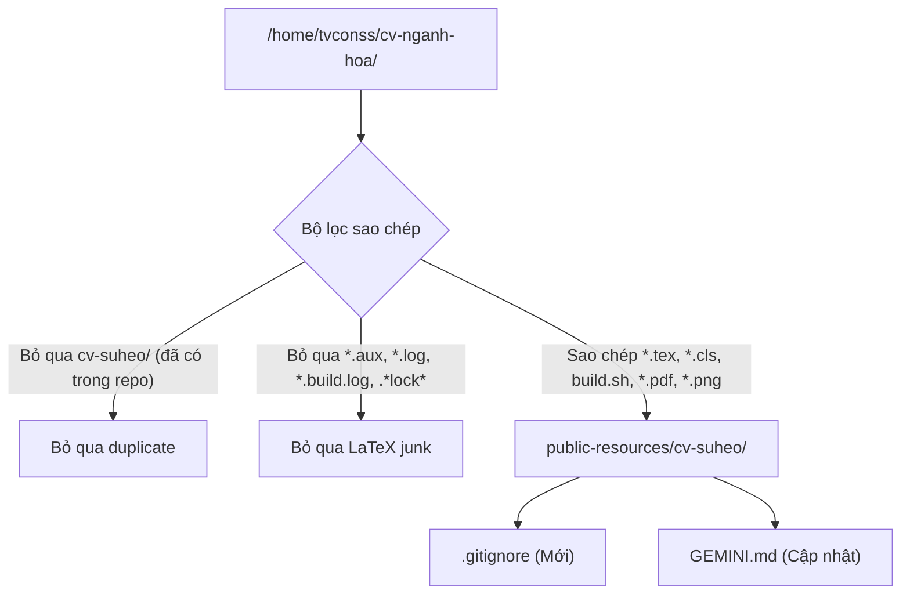

# Kế hoạch tích hợp CV ngành Hóa của Su Hẹo (`cv-suheo`) vào `public-resources`

## Tổng quan & Mục tiêu

Tích hợp toàn bộ dự án mã nguồn LaTeX CV ngành Hóa học của **Võ Ngọc Khả Ái (Su Hẹo)** từ thư mục local `/home/tvconss/cv-nganh-hoa` vào repository `public-resources`.

### Bối cảnh hiện tại:
* Repository `public-resources` đang có:
  * `cv-fullstack/`: CV chuyên ngành Software/Backend của Trần Văn Còn.
  * `SuHeo/`: Tài liệu báo cáo thực tập tại công ty Sơn Hải Vân của Võ Ngọc Khả Ái (`Báo cáo thực tập - Sơn Hải Vân.pptx`, kịch bản thuyết trình, ghi chú).
* Thư mục nguồn `/home/tvconss/cv-nganh-hoa` chứa:
  * Mã nguồn CV chuẩn 1 trang: `cv-khaai.tex` (Tiếng Việt) và `cv-khaai-en.tex` (Tiếng Anh) theo template tinh gọn 1 cột.
  * Các biến thể template hóa học khác: `cv-vi.tex`, `cv-en.tex`, `cv-v1-blue.tex`, `cv-v2-green.tex`, `cv-v3-maroon.tex`, `cv-v4-sidebar.tex`, `cv-v5-minimal.tex`, `cv-classic.tex`.
  * Các file class LaTeX: `cvchem.cls`, `cvchem-v2.cls`, ..., `cvclassic.cls`.
  * Kịch bản biên dịch: `build.sh` (hỗ trợ biên dịch XeLaTeX tự động và preview ảnh PNG).
  * Sản phẩm đã build trong `build/` (PDF, PNG).
  * **Thư mục con `cv-suheo/`:** Đã được kiểm tra `diff -rq` và xác nhận **trùng khớp 100%** với thư mục `SuHeo/` đang có trong repo.

---

## Yêu cầu người dùng phản hồi (User Review Required)

> [!IMPORTANT]
> **Vị trí và tên thư mục đích trong repository:**
> Đề xuất mặc định là đặt tại **`cv-suheo/`** ở thư mục gốc repo để tạo sự đồng bộ với `cv-fullstack/`:
> * `cv-fullstack/`: CV của Trần Văn Còn (Backend / Cloud).
> * `cv-suheo/`: CV của Võ Ngọc Khả Ái (Hóa học / QA/QC & R&D).
> * `SuHeo/`: Báo cáo thực tập và thuyết trình tại Sơn Hải Vân.
>
> *(Nếu bạn muốn đặt tên khác như `SuHeo/cv/` hoặc giữ nguyên `cv-nganh-hoa/`, hãy phản hồi để điều chỉnh).*

> [!WARNING]
> **Loại trừ thư mục con `cv-suheo/` khi sao chép:**
> Thư mục con `/home/tvconss/cv-nganh-hoa/cv-suheo` chứa các file slide PowerPoint (`.pptx` ~750KB) và tài liệu thực tập đã có sẵn trong `SuHeo/`. Do đó, kế hoạch sẽ **bỏ qua** thư mục con này để tránh nhân bản trùng lặp file trong Git.

> [!NOTE]
> **Dọn dẹp file trung gian trong `build/`:**
> Chỉ giữ lại các file sản phẩm cuối cùng (`*.pdf`, `*.png`), loại bỏ các file rác sinh ra trong quá trình biên dịch LaTeX (`*.aux`, `*.log`, `*.build.log`, `.~lock*`). Đồng thời bổ sung file `.gitignore` để tránh commit nhầm file rác trong tương lai.

---

## Câu hỏi mở (Open Questions)

1. Bạn có muốn đổi tên thư mục thành **`cv-suheo/`** (đề xuất) hay muốn giữ nguyên là **`cv-nganh-hoa/`** hay gom vào **`SuHeo/cv/`**?
*(Nếu bạn nhấn "Proceed" hoặc đồng ý, kế hoạch sẽ dùng tên `cv-suheo/`).*
2. Bạn có muốn bổ sung tính năng xuất định dạng Word (`.docx`) cho `cv-khaai.tex` thông qua pandoc (tương tự `cv-fullstack/convert.sh`) trong tương lai không?

---

## Đề xuất thay đổi (Proposed Changes)



### 1. Thư mục CV mới: `cv-suheo/`

#### [NEW] `cv-suheo/`
Sao chép có chọn lọc từ `/home/tvconss/cv-nganh-hoa/`:
* **Mã nguồn LaTeX:**
  * `cv-khaai.tex`: Bản Tiếng Việt chuẩn 1 trang A4 (font `Liberation Serif`, biên dịch `xelatex`, layout 1 cột chuẩn ATS).
  * `cv-khaai-en.tex`: Bản Tiếng Anh chuẩn 1 trang A4 (font `Charter`, biên dịch `xelatex`/`pdflatex`).
  * `cv-vi.tex`, `cv-en.tex`: Bản chi tiết đầy đủ 2 trang theo phong cách tạp chí hóa học.
  * `cv-v1-blue.tex` tới `cv-v5-minimal.tex`, `cv-classic.tex`: Các phiên bản biến thể thiết kế và màu sắc.
* **Document Classes:**
  * `cvchem.cls`, `cvchem-v2.cls`, `cvchem-v3.cls`, `cvchem-v4.cls`, `cvchem-v5.cls`, `cvclassic.cls`.
* **Kịch bản build:**
  * `build.sh`: Script tự động biên dịch và tạo ảnh preview PNG (giữ nguyên quyền execute `+x`).
* **Sản phẩm đầu ra sạch trong `cv-suheo/build/`:**
  * `cv-khaai.pdf`, `cv-khaai-page-1.png`
  * `cv-khaai-en.pdf`, `cv-khaai-en-page-1.png`
  * `cv-vi.pdf`, `cv-vi-page-*.png`
  * `cv-en.pdf`, `cv-en-page-*.png`
  * Các file `.pdf` và `.png` của các biến thể.

---

### 2. Cấu hình Git: `.gitignore`

#### [NEW] `.gitignore`
Tạo file `.gitignore` ở thư mục gốc repository để ngăn chặn việc commit các file tạm phát sinh khi biên dịch LaTeX và LibreOffice/MS Office:

```gitignore
# LaTeX temporary and log files
*.aux
*.log
*.out
*.build.log
*.toc
*.fls
*.fdb_latexmk
*.synctex.gz

# Office lock files
.~lock.*
~$*
```

---

### 3. Tài liệu ngữ cảnh AI: `GEMINI.md`

#### [MODIFY] `GEMINI.md`
Cập nhật mục **1. Giới thiệu Repository** và thêm mục **Dự án CV Ngành Hóa / QA/QC (cv-suheo)** để hướng dẫn các AI Agent khác hiểu rõ cấu trúc và vai trò của thư mục này:

```markdown
### Cấu trúc thư mục chính:
* `cv-fullstack/`: CV chuyên ngành Software / Backend (Trần Văn Còn).
* `cv-suheo/`: CV chuyên ngành Công nghệ Kỹ thuật Hóa học / QA/QC & R&D (Võ Ngọc Khả Ái - Su Hẹo).
* `SuHeo/`: Tài liệu báo cáo thực tập tại công ty Sơn Hải Vân (slide PPTX, kịch bản thuyết trình, ghi chú).
```

---

## Kế hoạch kiểm thử & xác minh (Verification Plan)

### Kiểm tra tự động (Automated Verification)
1. Kiểm tra sao chép không chứa file rác:
   ```bash
   find cv-suheo/build -type f -name "*.log" -o -name "*.aux" -o -name "*lock*"
   # Kết quả mong đợi: Trống (không có file rác)
   ```
2. Kiểm tra không có duplicate của `SuHeo/`:
   ```bash
   [[ ! -d cv-suheo/cv-suheo ]] && echo "Deduplication OK"
   ```
3. Chạy thử biên dịch các file CV chính với `build.sh`:
   ```bash
   cd cv-suheo && ./build.sh cv-khaai.tex cv-khaai-en.tex
   ```
4. Kiểm tra số trang chính xác của bản chuẩn (đúng 1 trang A4):
   ```bash
   pdfinfo cv-suheo/build/cv-khaai.pdf | grep Pages     # Phải ra 1
   pdfinfo cv-suheo/build/cv-khaai-en.pdf | grep Pages  # Phải ra 1
   ```
5. Kiểm tra git status đảm bảo mọi file mới được nhận diện sạch sẽ:
   ```bash
   git status --short
   ```

### Kiểm tra thủ công (Manual Verification)
* Kiểm tra mở thử `cv-suheo/build/cv-khaai-page-1.png` và `cv-suheo/build/cv-khaai-en-page-1.png` xem độ nét và bố cục đã hoàn thiện.
